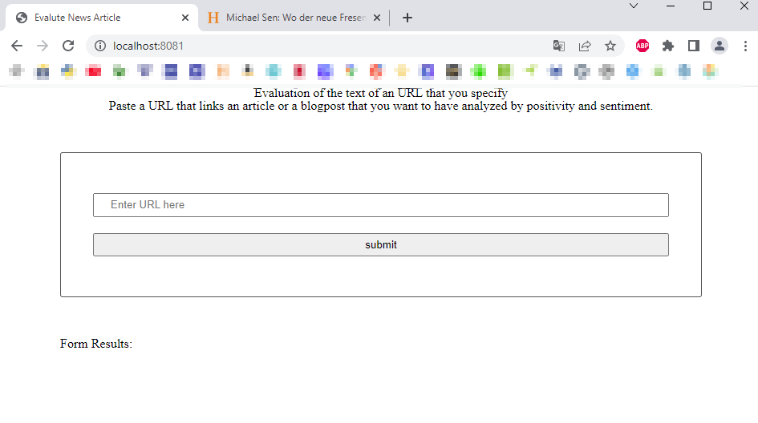
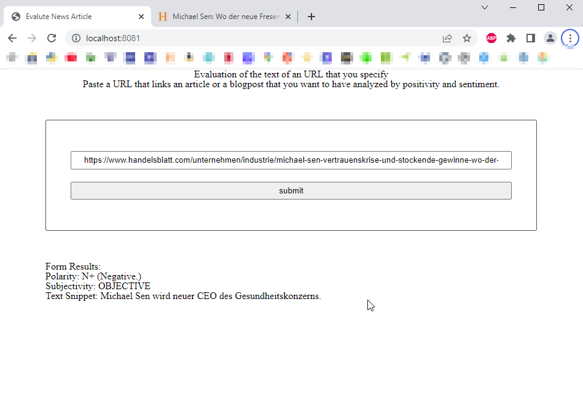

# Overview

This project was more complicated than the previous ones:
- goal is to create a page which can read in the url that you provide
- give the url to an NLP-API that will analyze the sentiment of the article / blogpost
- give the feedback about the article on our webpage

## Things I had to do

- use the code that I created during lesson 4
- create an account @ the MLP API site:  https://www.meaningcloud.com/
- change quite a lot in the code from lesson 4 to include the new API
- on the way of the development, install many different packages

### Where did changes happen?:

In almost all files...

- webpack.dev.js & *.prod.js: new plugins
- .gitignore: added ".env" so that my API Key stays safe
- server/index.js: added API credentials (incl. dotenv), added app.post to read url + communicate with API + send answer from API
- client/index.js: import + export from newly created "isUrlValid" function. Removed no longer used function "nameChecker"
- views/index.html: Adapted results from Form, added service-worker script (as in Script), changed title
- js/formHandler.js: Added "const postData" as in Lesson 3, adapted "handleSubmit" to call "isURLValid", read the response of the API Call, add it to the index.html elements + a little polarity checker
- js/isUrlValid.js: completely new file incl. a function to check if entered url is a valid url. Added an alert, if URL is not valid.

#### the result:

Is it beautiful? Absolutely not, but it seems to be working :)
The page:

The alert:

The result:
